# 实验三：单细胞基因表达最小二乘拟合 - 思维导图

```mermaid
graph TB
    A[实验三：单细胞基因表达<br/>最小二乘拟合及轨迹解析]

    A --> B[一、数据预处理]
    A --> C[二、基因维度优化]
    A --> D[三、时间点分配]
    A --> E[四、最小二乘拟合]
    A --> F[五、验证与分析]

    B --> B1[高可变基因筛选 HVG]
    B --> B2[标准化处理]
    B1 --> B1a[计算变异系数 CV]
    B1 --> B1b[保留前20%-30%基因]
    B2 --> B2a[消除测序深度差异]
    B2 --> B2b[对数归一化]

    C --> C1[方案1: K-means聚类]
    C --> C2[方案2: 并行分块]
    C1 --> C1a[基因表达模式聚类]
    C1 --> C1b[轮廓系数选最优k]
    C1 --> C1c[构建模块表达矩阵]
    C2 --> C2a[随机分块500基因/组]
    C2 --> C2b[并行拟合]

    D --> D1[全局时间轴]
    D --> D2[阶段内排序]
    D --> D3[抽样与时间点分配]

    D1 --> D1a[阶段标签固有顺序]
    D1 --> D1b[固定间隔 Δt=1]

    D2 --> D2a[筛选驱动模块]
    D2 --> D2b[按模块表达排序细胞]
    D2a --> D2a1[相邻阶段差异最大模块]

    D3 --> D3a[确定抽样量 ns≥3p+1]
    D3 --> D3b[均匀抽样]
    D3 --> D3c[时间点均匀插值]
    D3 --> D3d[单调性检验 ρ>0.8]

    E --> E1[普通最小二乘 OLS]
    E --> E2[Lasso正则化]
    E --> E3[交叉验证选λ]

    E1 --> E1a[多项式拟合 1,2,3次]
    E1 --> E1b[最小化残差平方和RSS]
    E1 --> E1c[求解正规方程]

    E2 --> E2a[增加L1正则化项]
    E2 --> E2b[防止过拟合]
    E2 --> E2c[λ控制正则化强度]

    E3 --> E3a[5折交叉验证]
    E3 --> E3b[选择CV-RMSE最小的λ]

    F --> F1[拟合优度评价]
    F --> F2[假设检验]
    F --> F3[负对照实验]
    F --> F4[轨迹排序验证]

    F1 --> F1a[R² 越接近1越好]
    F1 --> F1b[RMSE 越小越好]

    F2 --> F2a[Pearson相关性检验]
    F2 --> F2b[残差方差检验]
    F2 --> F2c[p<0.05 显著]

    F3 --> F3a[随机打乱时间点100次]
    F3 --> F3b[原始R² > 95%分位数]
    F3 --> F3c[验证轨迹可信]

    F4 --> F4a[基因投票排序]
    F4 --> F4b[NMI > 0.6]
    F4 --> F4c[ARI > 0.5]

    style A fill:#f9f,stroke:#333,stroke-width:4px
    style B fill:#bbf,stroke:#333
    style C fill:#bfb,stroke:#333
    style D fill:#fbf,stroke:#333
    style E fill:#ffb,stroke:#333
    style F fill:#bff,stroke:#333
```



---

## 核心流程简化版

```
┌─────────────────────────────────────────────────────────────────────────────┐
│                            实验三 核心流程                                   │
└─────────────────────────────────────────────────────────────────────────────┘

输入数据: 表达矩阵(cells × genes) + 细胞标签(阶段/分支)
                    │
                    ▼
┌─────────────────────────────────────────────────────────────────────────────┐
│  步骤1: 数据预处理                                                           │
│  ┌──────────────────┐    ┌──────────────────┐                               │
│  │ 高可变基因筛选    │ -> │ 标准化处理        │                               │
│  │ (CV前20%-30%)    │    │ (log-normalize)  │                               │
│  └──────────────────┘    └──────────────────┘                               │
└─────────────────────────────────────────────────────────────────────────────┘
                    │
                    ▼
┌─────────────────────────────────────────────────────────────────────────────┐
│  步骤2: 基因维度优化 (K-means聚类)                                           │
│  ┌──────────────────┐    ┌──────────────────┐    ┌──────────────────┐       │
│  │ 基因表达向量      │ -> │ K-means聚类       │ -> │ 模块表达矩阵     │       │
│  │ (2000-3000维)    │    │ (k=8-15)         │    │ (cells × k)      │       │
│  └──────────────────┘    └──────────────────┘    └──────────────────┘       │
└─────────────────────────────────────────────────────────────────────────────┘
                    │
                    ▼
┌─────────────────────────────────────────────────────────────────────────────┐
│  步骤3: 时间点分配                                                           │
│                                                                              │
│  全局时间轴          阶段内排序            抽样与分配                         │
│  ┌────────┐         ┌────────────┐        ┌────────────┐                    │
│  │Start   │ t∈[0,1] │选驱动模块   │        │均匀抽样     │                    │
│  │Mid     │ t∈[1,2] │按表达排序   │  --->  │时间点插值   │                    │
│  │End     │ t∈[2,3] │单调性检验   │        │检验 ρ>0.8  │                    │
│  └────────┘         └────────────┘        └────────────┘                    │
└─────────────────────────────────────────────────────────────────────────────┘
                    │
                    ▼
┌─────────────────────────────────────────────────────────────────────────────┐
│  步骤4: 最小二乘拟合                                                         │
│                                                                              │
│  目标: 拟合基因模块表达 y 与时间 t 的关系                                     │
│                                                                              │
│  ┌──────────────────────────────────────────────────────────────┐           │
│  │  OLS (普通最小二乘)                                          │           │
│  │  ŷ(t) = a₀ + a₁t + a₂t² + a₃t³                              │           │
│  │  最小化: RSS = Σ(yⱼ - ŷⱼ)²                                   │           │
│  └──────────────────────────────────────────────────────────────┘           │
│                                                                              │
│  ┌──────────────────────────────────────────────────────────────┐           │
│  │  Lasso (正则化最小二乘)                                       │           │
│  │  最小化: RSS + λΣ|aₘ|                                        │           │
│  │  5折交叉验证选最优 λ                                          │           │
│  └──────────────────────────────────────────────────────────────┘           │
└─────────────────────────────────────────────────────────────────────────────┘
                    │
                    ▼
┌─────────────────────────────────────────────────────────────────────────────┐
│  步骤5: 验证与分析                                                           │
│                                                                              │
│  ┌────────────┐  ┌────────────┐  ┌────────────┐  ┌────────────┐            │
│  │拟合优度    │  │假设检验    │  │负对照实验  │  │轨迹验证    │            │
│  │R², RMSE   │  │Pearson p   │  │打乱时间点  │  │NMI, ARI   │            │
│  └────────────┘  └────────────┘  └────────────┘  └────────────┘            │
└─────────────────────────────────────────────────────────────────────────────┘
                    │
                    ▼
输出: 拟合曲线 + 轨迹排序 + 验证结果
```

---

## 关键概念解释

| 概念 | 作用 | 公式/方法 |
|------|------|-----------|
| **HVG筛选** | 降维，保留有信息的基因 | $CV = \frac{\sigma}{\mu + \varepsilon}$ |
| **标准化** | 消除测序深度差异 | $X^{norm} = \ln(1 + \frac{X}{\sum X} \times 10000)$ |
| **K-means** | 基因聚类降维 | 最小化 $SSE = \sum\|x - \mu_c\|^2$ |
| **轮廓系数** | 评估聚类质量 | $s = \frac{b-a}{\max(a,b)}$ |
| **OLS** | 多项式拟合 | 最小化 $RSS = \sum(y - \hat{y})^2$ |
| **Lasso** | 正则化防过拟合 | $RSS + \lambda\sum\|a\|$ |
| **R²** | 拟合优度 | $1 - \frac{SS_{res}}{SS_{tot}}$ |
| **NMI/ARI** | 排序验证 | 与真实标签对比 |

---

## 数据流向图

```
原始数据
    │
    ├── 表达矩阵 (2000 cells × 1000 genes)
    │
    └── 细胞标签 (branch, stage, pseudotime)
           │
           ▼
    ┌──────────────┐
    │   预处理      │ ──> HVG筛选 + 标准化
    └──────────────┘
           │
           ▼
    ┌──────────────┐
    │  K-means聚类  │ ──> 8个基因模块
    └──────────────┘
           │
           ▼
    ┌──────────────┐
    │  时间点分配   │ ──> 每个分支: Start→Mid→End
    └──────────────┘      抽样108个细胞
           │
           ▼
    ┌──────────────┐
    │  最小二乘拟合 │ ──> OLS vs Lasso
    └──────────────┘      R²=0.92 (模块5)
           │
           ▼
    ┌──────────────┐
    │   验证分析    │ ──> 负对照通过
    └──────────────┘      NMI=1.0, ARI=1.0
```
