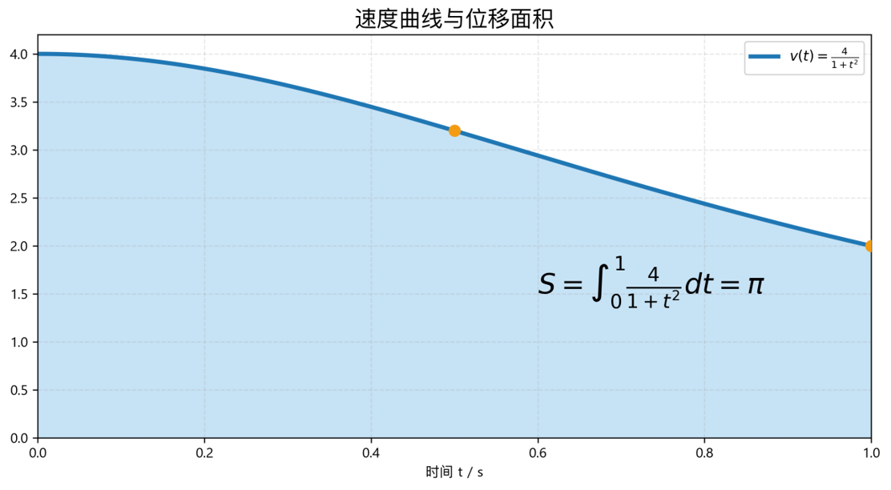
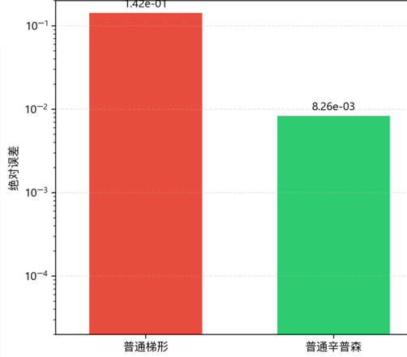
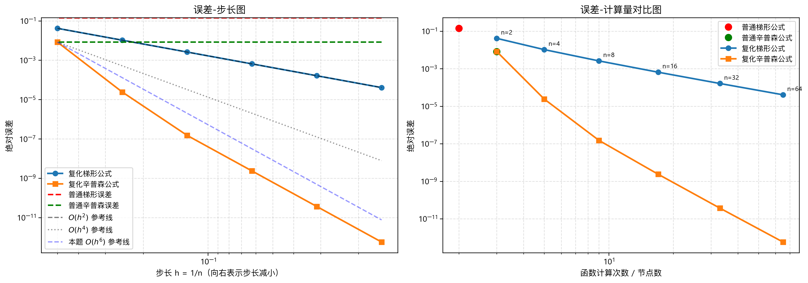
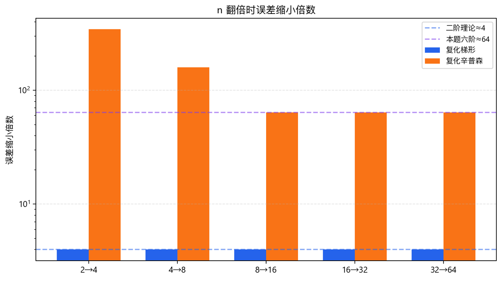
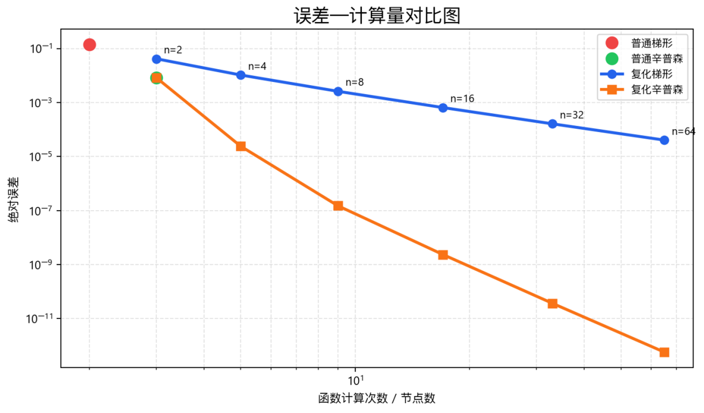

# 数值积分算法设计与实现实验报告

# 一、实验名称与团队分工

数值积分算法设计与实现（梯形公式、辛普森公式、复化求积）

 **组长（吴瑞东）:** 思考题1-5，撰写实验报告，制作讲解ppt

 **组员（**  **余眈阳**  **）**  **:** 梯形+复化梯形部分的公式推导，代码编写，结果计算

 **组员（饶宇佳）:** 辛普森公式的公式推导，代码编写，结果计算

 **组员（刘家乐）:** 复化辛普森公式的公式推导，代码编写，结果计算

 **组员（周亚辉）:** 汇总所有数据做误差分析，绘制图表，ppt讲解

---

# 二、实验目的

1. 理解数值积分的基本思想：用离散加权求和近似代替定积分，实现非线性函数积分的数值求解。
2. 掌握梯形求积公式、辛普森公式的推导原理与误差特性。
3. 掌握复化梯形公式、复化辛普森公式的算法思想，理解步长对精度的影响。
4. 通过 Python 编程实现数值积分，对比不同算法的计算精度、收敛速度和计算量。
5. 理解数值积分的线性性、误差阶、稳定性及其工程应用意义。
6. 结合工程位移计算问题，分析不同数值积分算法是否满足工程精度要求。

---

# 三、实验环境

- 编程语言：Python
- 运行环境：Python 3.x
- 使用库：`math`
- 是否需要额外第三方库：否

---

# 四、工程背景与问题描述

某滑块做非线性变速直线运动，瞬时速度函数为：

$$
v(t)=\frac{4}{1+t^2}\ \mathrm{m/s}
$$

要求该滑块在时间区间 $[0,1]$ 秒内的运动位移。根据运动学知识，位移等于速度函数在时间区间上的积分：

$$
S=\int_0^1 v(t)\,dt
=\int_0^1 \frac{4}{1+t^2}\,dt
$$

由于：

$$
\int \frac{4}{1+t^2}\,dt=4\arctan t+C
$$

所以精确位移为：

$$
S=4\arctan t\bigg|_0^1
$$

$$
S=4(\arctan 1-\arctan 0)
$$

又因为：

$$
\arctan 1=\frac{\pi}{4},\qquad \arctan 0=0
$$

所以：

$$
S=4\left(\frac{\pi}{4}-0\right)=\pi
$$

即精确值为：

$$
S=\pi\approx 3.1415926536\ \mathrm m
$$

在本实验中，所有数值积分结果均与精确值 $\pi$ 进行比较，绝对误差定义为：

$$
e=|\text{数值近似值}-\pi|
$$



---

# 五、实验原理与公式推导

---

## 5.1 数值积分基本思想

对于一般定积分：

$$
I=\int_a^b f(x)\,dx
$$

数值积分的基本思想是选取若干个离散节点 $x_i$，用加权求和近似积分：

$$
I\approx Q[f]=\sum_{i=0}^n w_i f(x_i)
$$

其中：

- $x_i$ 为积分节点；
- $w_i$ 为积分权重；
- $Q[f]$ 为数值积分近似值。

数值积分本质上是用简单函数，例如直线、抛物线或分段多项式，近似原函数曲线，再计算近似函数下方的面积。

---

## 5.2 数值积分的线性性

若数值积分公式为：

$$
Q[f]=\sum_{i=0}^n w_i f(x_i)
$$

则对于任意常数 $\alpha,\beta$ 和函数 $f(x),g(x)$，有：

$$
Q[\alpha f+\beta g]
=
\sum_{i=0}^n w_i[\alpha f(x_i)+\beta g(x_i)]
$$

展开得：

$$
Q[\alpha f+\beta g]
=
\alpha\sum_{i=0}^n w_i f(x_i)
+
\beta\sum_{i=0}^n w_i g(x_i)
$$

因此：

$$
Q[\alpha f+\beta g]
=
\alpha Q[f]+\beta Q[g]
$$

这说明数值积分公式具有线性性。

在工程中，如果一个总物理量由多个分量叠加组成，例如：

$$
v(t)=v_1(t)+v_2(t)
$$

则位移满足：

$$
\int_a^b v(t)\,dt
=
\int_a^b v_1(t)\,dt
+
\int_a^b v_2(t)\,dt
$$

因此数值积分的线性性有利于工程中的模块化建模、多物理量叠加计算和复杂系统分解分析。

---

# 六、普通梯形公式

---

## 6.1 公式推导

在区间 $[a,b]$ 上，用经过两点 $(a,f(a))$ 和 $(b,f(b))$ 的直线近似函数 $f(x)$。

梯形面积为：

$$
T=\frac{b-a}{2}[f(a)+f(b)]
$$

因此普通梯形公式为：

$$
\boxed{
T=\frac{b-a}{2}[f(a)+f(b)]
}
$$

---

## 6.2 梯形公式误差

若 $f(x)$ 在 $[a,b]$ 上二阶连续可导，则梯形公式误差为：

$$
E_T=I-T=-\frac{(b-a)^3}{12}f''(\xi)
$$

其中：

$$
\xi\in(a,b)
$$

因此普通梯形公式的局部误差阶为：

$$
O((b-a)^3)
$$

梯形公式对一次多项式精确，但对二次及以上多项式一般不精确。

---

## 6.3 本题普通梯形公式计算

本题中：

$$
f(t)=\frac{4}{1+t^2},\qquad a=0,\qquad b=1
$$

端点函数值为：

$$
f(0)=4
$$

$$
f(1)=2
$$

代入梯形公式：

$$
T=\frac{1-0}{2}[f(0)+f(1)]
$$

$$
T=\frac12(4+2)=3
$$

绝对误差为：

$$
|\pi-T|=|\pi-3|\approx 0.1415926536
$$

---

# 七、普通辛普森公式

---

## 7.1 公式推导

辛普森公式使用三个节点：

$$
a,\qquad m=\frac{a+b}{2},\qquad b
$$

通过这三个点构造二次插值多项式，用抛物线近似原函数曲线。

普通辛普森公式为：

$$
\boxed{
S=\frac{b-a}{6}
\left[
f(a)+4f\left(\frac{a+b}{2}\right)+f(b)
\right]
}
$$

也可令：

$$
h=\frac{b-a}{2}
$$

写成：

$$
S=\frac{h}{3}[f(a)+4f(a+h)+f(a+2h)]
$$

---

## 7.2 辛普森公式误差

若 $f(x)$ 在 $[a,b]$ 上四阶连续可导，则普通辛普森公式误差为：

$$
E_S=I-S
=
-\frac{(b-a)^5}{2880}f^{(4)}(\xi)
$$

其中：

$$
\xi\in(a,b)
$$

因此普通辛普森公式的局部误差阶为：

$$
O((b-a)^5)
$$

辛普森公式的代数精度为 3，即它对三次及三次以下多项式均可精确积分。

---

## 7.3 为什么辛普森公式对三次多项式精确？

设区间中心为 $m$，令：

$$
x=m+u
$$

任意三次多项式可写为：

$$
p(x)=c_0+c_1u+c_2u^2+c_3u^3
$$

在对称区间 $[-h,h]$ 上：

$$
\int_{-h}^{h}u\,du=0
$$

$$
\int_{-h}^{h}u^3\,du=0
$$

所以奇次项积分为零。

辛普森公式在对称节点 $m-h,m,m+h$ 上计算时，奇次项同样会互相抵消。因此辛普森公式不仅对二次多项式精确，也对三次多项式精确。

---

## 7.4 本题普通辛普森公式计算

本题区间为 $[0,1]$，中点为：

$$
m=\frac{0+1}{2}=0.5
$$

函数值为：

$$
f(0)=4
$$

$$
f(0.5)=\frac{4}{1+0.5^2}=3.2
$$

$$
f(1)=2
$$

代入普通辛普森公式：

$$
S=\frac{1}{6}[f(0)+4f(0.5)+f(1)]
$$

$$
S=\frac{1}{6}(4+4\times 3.2+2)
$$

$$
S=3.1333333333
$$

绝对误差为：

$$
|\pi-S|\approx 0.0082593203
$$

相比普通梯形公式，普通辛普森公式误差明显更小。这是因为辛普森公式使用二次抛物线近似曲线，而梯形公式只使用直线近似曲线。

---

# 八、复化梯形公式

---

## 8.1 区间划分

将区间 $[a,b]$ 等分为 $n$ 份：

$$
a=x_0<x_1<\cdots<x_n=b
$$

步长为：

$$
h=\frac{b-a}{n}
$$

节点为：

$$
x_i=a+ih,\qquad i=0,1,\cdots,n
$$

---

## 8.2 公式推导

在每个小区间 $[x_i,x_{i+1}]$ 上使用梯形公式：

$$
\int_{x_i}^{x_{i+1}} f(x)\,dx
\approx
\frac{h}{2}[f(x_i)+f(x_{i+1})]
$$

对所有小区间求和：

$$
T_n=
\sum_{i=0}^{n-1}
\frac{h}{2}[f(x_i)+f(x_{i+1})]
$$

展开并合并同类项：

$$
T_n=
\frac{h}{2}
[
f(x_0)+2f(x_1)+2f(x_2)+\cdots+2f(x_{n-1})+f(x_n)
]
$$

因此复化梯形公式为：

$$
\boxed{
T_n
=
h
\left[
\frac{f(x_0)+f(x_n)}{2}
+
\sum_{i=1}^{n-1}f(x_i)
\right]
}
$$

---

## 8.3 复化梯形公式误差

单个小区间的梯形公式误差为：

$$
O(h^3)
$$

共有约：

$$
n=\frac{b-a}{h}
$$

个小区间，因此整体误差为：

$$
O(h^3)\cdot O\left(\frac1h\right)=O(h^2)
$$

更精确地：

$$
E_{T_n}=I-T_n
=
-\frac{b-a}{12}h^2f''(\xi)
$$

其中：

$$
\xi\in(a,b)
$$

所以复化梯形公式是二阶方法：

$$
\boxed{
E_{T_n}=O(h^2)
}
$$

当步长减半，即：

$$
h\rightarrow \frac h2
$$

误差大约变为：

$$
\left(\frac h2\right)^2=\frac{h^2}{4}
$$

因此复化梯形公式中，$n$ 每翻倍一次，误差通常约缩小 4 倍。

---

# 九、复化辛普森公式

---

## 9.1 区间划分要求

复化辛普森公式要求区间等分数 $n$ 必须为偶数。

将 $[a,b]$ 等分为 $n$ 份：

$$
h=\frac{b-a}{n}
$$

节点为：

$$
x_i=a+ih,\qquad i=0,1,\cdots,n
$$

其中 $n$ 为偶数。

---

## 9.2 公式推导

复化辛普森公式每两个小区间使用一次辛普森公式。

在区间 $[x_{2k},x_{2k+2}]$ 上：

$$
\int_{x_{2k}}^{x_{2k+2}} f(x)\,dx
\approx
\frac{h}{3}
[
f(x_{2k})
+4f(x_{2k+1})
+f(x_{2k+2})
]
$$

其中：

$$
k=0,1,\cdots,\frac n2-1
$$

把所有辛普森面板相加，得到：

$$
S_n=
\frac{h}{3}
[
f(x_0)
+4f(x_1)
+2f(x_2)
+4f(x_3)
+\cdots
+2f(x_{n-2})
+4f(x_{n-1})
+f(x_n)
]
$$

因此复化辛普森公式为：

$$
\boxed{
S_n
=
\frac{h}{3}
\left[
f(x_0)+f(x_n)
+
4\sum_{\substack{i=1\\i\ \mathrm{odd}}}^{n-1}f(x_i)
+
2\sum_{\substack{i=2\\i\ \mathrm{even}}}^{n-2}f(x_i)
\right]
}
$$

---

## 9.3 复化辛普森公式误差

单个辛普森面板覆盖两个小区间，局部误差为：

$$
O(h^5)
$$

面板数量约为：

$$
O\left(\frac1h\right)
$$

所以整体误差为：

$$
O(h^5)\cdot O\left(\frac1h\right)=O(h^4)
$$

因此复化辛普森公式是四阶方法：

$$
\boxed{
E_{S_n}=O(h^4)
}
$$

一般情况下，当步长减半时：

$$
h\rightarrow \frac h2
$$

误差约变为：

$$
\left(\frac h2\right)^4=\frac{h^4}{16}
$$

所以一般复化辛普森公式在 $n$ 翻倍时，误差约缩小 16 倍。

---

# 十、本题复化辛普森公式误差快速下降的原因

本节是本报告的重点。

从一般理论看，复化辛普森公式是四阶方法：

$$
E_{S_n}=O(h^4)
$$

所以通常情况下，步长减半，误差约缩小：

$$
2^4=16
$$

倍。

---

## 10.1 复化辛普森误差的精细展开式

对于足够光滑的函数，复化辛普森公式的误差不仅可以粗略写成 $O(h^4)$，还可以写成更精细的渐近展开式：

$$
E_n
=
-\frac{h^4}{180}
\left[
f'''(1)-f'''(0)
\right]
+
\frac{h^6}{1512}
\left[
f^{(5)}(1)-f^{(5)}(0)
\right]
+
O(h^8)
$$

其中：

$$
E_n=I-S_n
$$

本题中区间为 $[0,1]$，所以：

$$
h=\frac1n
$$

这个展开式说明，复化辛普森误差实际上具有如下结构：

$$
E_n=Ah^4+Bh^6+O(h^8)
$$

其中：

$$
A=-\frac{1}{180}[f'''(1)-f'''(0)]
$$

$$
B=\frac{1}{1512}[f^{(5)}(1)-f^{(5)}(0)]
$$

一般情况下，$A\neq 0$，所以误差主项是 $Ah^4$，算法表现为四阶收敛。

但是如果本题中恰好有：

$$
A=0
$$

则 $h^4$ 项会完全消失，误差主项就会变成 $Bh^6$，算法会表现出六阶收敛特征。

---

## 10.2 本题三阶导数计算

本题函数为：

$$
f(x)=\frac{4}{1+x^2}
$$

也可以写成：

$$
f(x)=4(1+x^2)^{-1}
$$

一阶导数为：

$$
f'(x)=-\frac{8x}{(1+x^2)^2}
$$

二阶导数为：

$$
f''(x)=\frac{8(3x^2-1)}{(1+x^2)^3}
$$

三阶导数为：

$$
f'''(x)=\frac{96x(1-x^2)}{(1+x^2)^4}
$$

代入端点 $x=0$：

$$
f'''(0)
=
\frac{96\cdot 0\cdot (1-0^2)}{(1+0^2)^4}
=0
$$

代入端点 $x=1$：

$$
f'''(1)
=
\frac{96\cdot 1\cdot (1-1^2)}{(1+1^2)^4}
=0
$$

因此：

$$
f'''(1)-f'''(0)=0
$$

于是误差展开式中的 $h^4$ 项变为：

$$
-\frac{h^4}{180}[f'''(1)-f'''(0)]
=
-\frac{h^4}{180}\cdot 0
=0
$$

也就是说，本题中复化辛普森公式的一般四阶误差主项完全抵消。

---

## 10.3 五阶导数计算

为了判断下一项是否为零，需要计算五阶导数。

本题函数的五阶导数为：

$$
f^{(5)}(x)
=
\frac{960x(-3+10x^2-3x^4)}{(1+x^2)^6}
$$

代入 $x=0$：

$$
f^{(5)}(0)=0
$$

代入 $x=1$：

$$
f^{(5)}(1)
=
\frac{960\cdot1(-3+10-3)}{(1+1)^6}
$$

括号内为：

$$
-3+10-3=4
$$

分母为：

$$
(1+1)^6=64
$$

所以：

$$
f^{(5)}(1)=\frac{960\cdot4}{64}=60
$$

因此：

$$
f^{(5)}(1)-f^{(5)}(0)=60\neq 0
$$

---

## 10.4 得到本题的真实误差主项

因为：

$$
f'''(1)-f'''(0)=0
$$

所以 $h^4$ 项消失。

误差展开式变为：

$$
E_n=
\frac{h^6}{1512}
[
f^{(5)}(1)-f^{(5)}(0)
]
+
O(h^8)
$$

代入：

$$
f^{(5)}(1)-f^{(5)}(0)=60
$$

得到：

$$
E_n=
\frac{60}{1512}h^6+O(h^8)
$$

化简：

$$
\frac{60}{1512}=\frac{5}{126}
$$

因此：

$$
\boxed{
E_n=
\frac{5}{126}h^6+O(h^8)
}
$$

这说明本题中复化辛普森公式实际表现为六阶收敛：

$$
\boxed{
E_n=O(h^6)
}
$$

---

## 10.5 为什么误差约缩小 64 倍？

本题中：

$$
E_n\approx \frac{5}{126}h^6
$$

当 $n$ 翻倍时，步长减半：

$$
h\rightarrow \frac h2
$$

新的误差为：

$$
E_{2n}
\approx
\frac{5}{126}
\left(\frac h2\right)^6
$$

即：

$$
E_{2n}
\approx
\frac{1}{64}
\cdot
\frac{5}{126}h^6
$$

而：

$$
E_n\approx \frac{5}{126}h^6
$$

所以：

$$
\boxed{
E_{2n}\approx \frac1{64}E_n
}
$$

也就是说，本题中复化辛普森公式在 $n$ 翻倍时，误差不是一般情况下约缩小 16 倍，而是接近缩小 64 倍。

---

## 10.6 小结：快速下降的根本原因

本题复化辛普森公式误差下降特别快的根本原因是：

1. 复化辛普森公式一般是四阶方法，误差主项通常为 $h^4$；
2. 但本题函数满足：

   $$
   f'''(0)=0,\qquad f'''(1)=0
   $$
3. 因此复化辛普森误差展开式中的 $h^4$ 主项：

   $$
   -\frac{h^4}{180}[f'''(1)-f'''(0)]
   $$

   完全消失；
4. 误差主项后移到 $h^6$ 项：

   $$
   E_n=\frac{5}{126}h^6+O(h^8)
   $$
5. 所以步长减半时，误差约缩小：

   $$
   2^6=64
   $$

   倍。

因此，本题中复化辛普森公式表现出比一般四阶理论更快的误差下降速度。

---

# 十一、Python 程序实现

```python
import math


def v(t):
    """
    速度函数：
    v(t)=4/(1+t^2)
    """
    return 4.0 / (1.0 + t * t)


EXACT = math.pi


def trapezoid_single(f, a, b):
    """
    普通梯形公式：
    T = (b-a)/2 * [f(a)+f(b)]
    """
    return (b - a) * (f(a) + f(b)) / 2.0


def simpson_single(f, a, b):
    """
    普通辛普森公式：
    S = (b-a)/6 * [f(a)+4f((a+b)/2)+f(b)]
    """
    m = (a + b) / 2.0
    return (b - a) * (f(a) + 4.0 * f(m) + f(b)) / 6.0


def composite_trapezoid(f, a, b, n):
    """
    复化梯形公式：
    T_n = h * [(f(x0)+f(xn))/2 + sum f(x_i)]
    """
    h = (b - a) / n
    total = 0.5 * (f(a) + f(b))

    for i in range(1, n):
        x_i = a + i * h
        total += f(x_i)

    return h * total


def composite_simpson(f, a, b, n):
    """
    复化辛普森公式。
    n 必须为偶数。
    """
    if n % 2 != 0:
        raise ValueError("复化辛普森公式要求 n 必须为偶数。")

    h = (b - a) / n

    odd_sum = 0.0
    even_sum = 0.0

    for i in range(1, n):
        x_i = a + i * h

        if i % 2 == 1:
            odd_sum += f(x_i)
        else:
            even_sum += f(x_i)

    return h / 3.0 * (f(a) + f(b) + 4.0 * odd_sum + 2.0 * even_sum)


def main():
    a = 0.0
    b = 1.0

    print("精确值：")
    print(f"pi = {EXACT:.15f}")
    print()

    T = trapezoid_single(v, a, b)
    S = simpson_single(v, a, b)

    print("普通公式：")
    print(f"普通梯形公式结果：   {T:.15f}, 绝对误差：{abs(T - EXACT):.15e}")
    print(f"普通辛普森公式结果： {S:.15f}, 绝对误差：{abs(S - EXACT):.15e}")
    print()

    print("复化公式：")
    print(f"{'n':>6} | {'复化梯形结果':>18} | {'梯形误差':>14} | {'复化辛普森结果':>18} | {'辛普森误差':>14}")
    print("-" * 86)

    for n in [2, 4, 8, 16, 32, 64]:
        Tn = composite_trapezoid(v, a, b, n)
        Sn = composite_simpson(v, a, b, n)

        print(
            f"{n:6d} | "
            f"{Tn:18.12f} | "
            f"{abs(Tn - EXACT):14.6e} | "
            f"{Sn:18.12f} | "
            f"{abs(Sn - EXACT):14.6e}"
        )


if __name__ == "__main__":
    main()
```

---

# 十二、实验结果

精确值为：

$$
\pi\approx 3.1415926536
$$

---

## 12.1 普通梯形与普通辛普森结果

| 方法           |     数值结果 |     绝对误差 |
| -------------- | -----------: | -----------: |
| 普通梯形公式   | 3.0000000000 | 0.1415926536 |
| 普通辛普森公式 | 3.1333333333 | 0.0082593203 |

由结果可知，普通辛普森公式的精度明显高于普通梯形公式。

原因是：

- 梯形公式使用直线近似非线性曲线；
- 辛普森公式使用二次抛物线近似曲线；
- 对本题函数 $4/(1+t^2)$ 这种光滑非线性函数，抛物线拟合效果明显优于直线拟合。
- 

---

## 12.2 复化梯形与复化辛普森结果

| 等分数$n$ |   复化梯形结果 |        复化梯形绝对误差 | 复化辛普森结果 |      复化辛普森绝对误差 |
| --------: | -------------: | ----------------------: | -------------: | ----------------------: |
|         2 | 3.100000000000 | $4.159265\times10^{-2}$ | 3.133333333333 | $8.259320\times10^{-3}$ |
|         4 | 3.131176470588 | $1.041618\times10^{-2}$ | 3.141568627451 | $2.402614\times10^{-5}$ |
|         8 | 3.138988494491 | $2.604159\times10^{-3}$ | 3.141592502459 | $1.511311\times10^{-7}$ |
|        16 | 3.140941612041 | $6.510415\times10^{-4}$ | 3.141592651225 | $2.364971\times10^{-9}$ |
|        32 | 3.141429893174 | $1.627604\times10^{-4}$ | 3.141592653553 |    $3.70\times10^{-11}$ |
|        64 | 3.141551963485 | $4.069010\times10^{-5}$ | 3.141592653589 |     $5.8\times10^{-13}$ |

---

## 12.3 误差—步长与计算量对比图

为了更直观地观察固定积分区间 $[0,1]$ 下，等分份数 $n$ 改变时误差的变化规律，并对比四种算法的计算精度、收敛速度和计算量，本文绘制了误差—步长图和误差—计算量对比图，如图所示。

由左侧误差—步长图可以看出，在固定积分区间 $[0,1]$ 下，随着等分份数 $n$ 增大，步长

$$
h=\frac{1}{n}
$$

不断减小，复化梯形公式和复化辛普森公式的绝对误差均明显下降。

普通梯形公式和普通辛普森公式只在整个区间上进行一次求积，因此其误差不随 $n$ 改变，在图中表现为水平虚线。普通辛普森公式的误差明显小于普通梯形公式，说明二次抛物线近似比直线近似更适合本题的非线性速度函数。

从图中还可以看出，复化梯形公式的误差曲线与 $O(h^2)$ 参考线基本平行，说明其误差满足二阶收敛规律，即当 $n$ 每翻倍一次、步长 $h$ 减半时，误差大约缩小为原来的四分之一。

复化辛普森公式的误差下降速度明显快于复化梯形公式。一般情况下，复化辛普森公式为四阶方法，误差满足 $O(h^4)$；但本题中，由于被积函数

$$
f(t)=\frac{4}{1+t^2}
$$

满足

$$
f'''(0)=0,\qquad f'''(1)=0
$$

导致复化辛普森误差展开式中的 $h^4$ 主项抵消，因此本题中复化辛普森公式实际表现出接近 $O(h^6)$ 的收敛特征。图中复化辛普森误差曲线与 $O(h^6)$ 参考线更接近，也验证了前文的理论分析。

由右侧误差—计算量对比图可以看出，普通梯形公式和普通辛普森公式的函数计算次数很少，但精度有限。复化梯形公式和复化辛普森公式的计算量均随节点数增加而线性增长，即计算量均约为 $O(n)$。但是在相同或相近函数计算次数下，复化辛普森公式的误差远小于复化梯形公式，说明复化辛普森公式具有更高的计算效率和精度优势。

因此，从图像结果可以直观看出：

1. 固定区间 $[0,1]$ 时，增大等分份数 $n$、减小步长 $h$ 能有效降低复化求积误差；
2. 普通辛普森公式精度高于普通梯形公式；
3. 复化求积公式精度明显优于普通求积公式；
4. 复化辛普森公式在相同计算量下精度最高，收敛速度最快；
5. 本题中复化辛普森公式由于误差主项抵消，实际表现出比一般四阶更快的六阶收敛特征。

---

# 十三、误差分析

---

## 13.1 步长与误差关系

本题积分区间固定为 $[0,1]$，所以：

$$
h=\frac{1}{n}
$$

当 $n$ 增大时，步长 $h$ 减小，函数曲线在每个小区间内更接近直线或抛物线，因此数值积分误差减小。

---

## 13.2 复化梯形误差分析

复化梯形公式理论误差为：

$$
E_{T_n}=O(h^2)
$$

由于：

$$
h=\frac1n
$$

所以：

$$
E_{T_n}=O\left(\frac1{n^2}\right)
$$

当 $n$ 翻倍时：

$$
h\rightarrow \frac h2
$$

误差约变为：

$$
\frac14
$$

从实验数据看：

$$
4.159265\times10^{-2}
\rightarrow
1.041618\times10^{-2}
\rightarrow
2.604159\times10^{-3}
\rightarrow
6.510415\times10^{-4}
$$

每次 $n$ 翻倍，误差基本缩小为原来的四分之一，符合二阶收敛规律。

---

## 13.3 复化辛普森误差分析

复化辛普森公式一般误差阶为：

$$
E_{S_n}=O(h^4)
$$

因此一般情况下，步长减半时，误差约缩小：

$$
2^4=16
$$

倍。

但本题中，复化辛普森误差下降更快

原因如下：

> 本题函数使复化辛普森公式误差展开式中的 $h^4$ 主项为零。

本题的精细误差展开为：

$$
E_n
=
-\frac{h^4}{180}
[
f'''(1)-f'''(0)
]
+
\frac{h^6}{1512}
[
f^{(5)}(1)-f^{(5)}(0)
]
+
O(h^8)
$$

对：

$$
f(x)=\frac{4}{1+x^2}
$$

有：

$$
f'''(x)=\frac{96x(1-x^2)}{(1+x^2)^4}
$$

所以：

$$
f'''(0)=0,\qquad f'''(1)=0
$$

因此：

$$
f'''(1)-f'''(0)=0
$$

导致 $h^4$ 主项消失。

继续计算有：

$$
f^{(5)}(0)=0,\qquad f^{(5)}(1)=60
$$

所以：

$$
E_n=
\frac{60}{1512}h^6+O(h^8)
=
\frac{5}{126}h^6+O(h^8)
$$

因此本题复化辛普森公式实际表现为六阶收敛：

$$
E_n=O(h^6)
$$

当 $n$ 翻倍时，步长减半，误差约缩小：

$$
2^6=64
$$

倍。

实验中也能观察到这一点：

| 区间变化         |                                                             误差比 |
| ---------------- | -----------------------------------------------------------------: |
| $n=8$ 到 $n=16$  | $\dfrac{1.511311\times10^{-7}}{2.364971\times10^{-9}}\approx 63.9$ |
| $n=16$ 到 $n=32$ |                                                             约$64$ |

这说明实验数据与理论分析一致。



---

## 13.4 四种算法对比

| 方法           |             使用节点 | 近似思想               |                        理论误差阶 | 计算量 | 精度表现           |
| -------------- | -------------------: | ---------------------- | --------------------------------: | -----: | ------------------ |
| 普通梯形公式   |                 2 个 | 一条直线近似整段曲线   |                      局部$O(h^3)$ |   极低 | 精度最低           |
| 普通辛普森公式 |                 3 个 | 一条抛物线近似整段曲线 |                      局部$O(h^5)$ |   很低 | 明显优于普通梯形   |
| 复化梯形公式   |             $n+1$ 个 | 分段直线近似           |                      全局$O(h^2)$ | $O(n)$ | 稳定收敛           |
| 复化辛普森公式 | $n+1$ 个，$n$ 为偶数 | 分段抛物线近似         | 一般$O(h^4)$，本题表现为 $O(h^6)$ | $O(n)$ | 精度最高、收敛最快 |



---

# 十四、工程精度分析

假设基础工程精度要求为：

$$
10^{-3}\ \mathrm m
$$

则：

- 普通梯形公式误差约为 $1.42\times10^{-1}$，不满足要求；
- 普通辛普森公式误差约为 $8.26\times10^{-3}$，不满足 $10^{-3}$ 精度要求；
- 复化梯形公式在 $n=16$ 时误差约为 $6.51\times10^{-4}$，满足要求；
- 复化辛普森公式在 $n=4$ 时误差约为 $2.40\times10^{-5}$，已经满足要求。

如果工程精度要求提高到：

$$
10^{-4}\ \mathrm m
$$

则：

- 复化梯形公式需要更大的 $n$，例如 $n=64$ 时误差约为 $4.07\times10^{-5}$；
- 复化辛普森公式在 $n=4$ 时已经满足要求。

因此，在本实验问题中，复化辛普森公式能够用较少的节点获得极高精度，具有较高工程应用价值。

---

# 十五、实验思考题

---

## 1. 为什么辛普森公式对三次多项式精确？

辛普森公式虽然由二次插值推导而来，但由于其节点关于区间中点对称，三次多项式中的奇次项在积分和求积公式中都会抵消。

令：

$$
p(x)=c_0+c_1u+c_2u^2+c_3u^3
$$

在对称区间 $[-h,h]$ 上：

$$
\int_{-h}^{h}u\,du=0,\qquad
\int_{-h}^{h}u^3\,du=0
$$

所以三次项不影响最终积分误差，辛普森公式可对三次多项式精确。

---

## 2. 复化梯形和复化辛普森的误差阶为什么不同？

复化梯形公式本质上是分段一次插值，单个小区间局部误差为：

$$
O(h^3)
$$

总共有约 $1/h$ 个小区间，因此全局误差为：

$$
O(h^3)\cdot O\left(\frac1h\right)=O(h^2)
$$

复化辛普森公式本质上是分段二次插值，且具有三次代数精度，单个面板局部误差为：

$$
O(h^5)
$$

总共有约 $1/h$ 个面板，因此全局误差为：

$$
O(h^5)\cdot O\left(\frac1h\right)=O(h^4)
$$

所以复化辛普森公式误差阶高于复化梯形公式。

---

## 3. 数值积分的线性性在工程计算中有什么意义？

数值积分线性性表示：

$$
Q[\alpha f+\beta g]=\alpha Q[f]+\beta Q[g]
$$

在工程中，如果总速度、总载荷、总热流、总信号由多个分量叠加组成，则可以分别对各分量积分后再相加，也可以先叠加再积分。

这有利于：

1. 分解复杂工程问题；
2. 模块化程序设计；
3. 多物理场耦合计算；
4. 多信号、多载荷的叠加分析。

---

## 4. 机器学习拟合积分与传统复化积分相比，各有哪些工程优缺点？

机器学习拟合积分的优点是可以处理离散数据、带噪声数据和趋势数据，拟合完成后可直接解析积分。

缺点是阶数选择困难，可能出现欠拟合、过拟合和高阶振荡，而且误差估计不如传统复化积分明确。

传统复化积分方法原理清晰、误差阶明确、稳定性好，适合大多数光滑工程函数，但对于带噪实验数据的建模能力不如机器学习拟合方法灵活。

---

## 5. 结合本次实验，简述数值积分误差阶在工程精度把控中的作用。

误差阶描述步长减小时误差下降的速度。

若误差满足：

$$
E=O(h^p)
$$

则步长减半时，误差大约缩小：

$$
2^p
$$

倍。

因此：

- 复化梯形公式 $p=2$，步长减半误差约缩小 4 倍；
- 复化辛普森公式一般 $p=4$，步长减半误差约缩小 16 倍；
- 本题中复化辛普森由于误差主项抵消，实际表现为 $p=6$，步长减半误差约缩小 64 倍。

在工程计算中，误差阶可以帮助工程人员根据精度要求选择合适算法和合适步长，从而在保证精度的同时减少计算成本。

---

# 十六、实验结论

1. 普通梯形公式只利用区间两端点信息，用直线近似非线性曲线，因此误差较大。
2. 普通辛普森公式使用二次抛物线近似函数曲线，对非线性函数的拟合能力明显强于梯形公式。
3. 复化求积通过缩小步长，将大区间划分为多个小区间，可以显著减小截断误差。
4. 复化梯形公式是二阶方法，误差满足：

   $$
   E_{T_n}=O(h^2)
   $$
5. 复化辛普森公式一般是四阶方法，误差满足：

   $$
   E_{S_n}=O(h^4)
   $$
6. 本题中复化辛普森公式误差下降特别快，根本原因是：

   $$
   f'''(0)=0,\qquad f'''(1)=0
   $$

   使得误差展开式中的 $h^4$ 主项消失。
7. 本题中复化辛普森公式的真实主误差项为：

   $$
   E_n=\frac{5}{126}h^6+O(h^8)
   $$

   因此实际表现为六阶收敛，步长减半时误差约缩小 64 倍。
8. 对于工程位移计算，若精度要求为 $10^{-3}\ \mathrm m$，复化梯形公式取 $n=16$ 可以满足要求，而复化辛普森公式取 $n=4$ 已经可以满足要求。
9. 综合精度、收敛速度和计算量来看，复化辛普森公式在本实验中表现最好，具有较高工程实用价值。

---

# 十七、附录

## 计算

```python
import math


def v(t):
    return 4.0 / (1.0 + t * t)


EXACT = math.pi


def trapezoid_single(f, a, b):
    return (b - a) * (f(a) + f(b)) / 2.0


def simpson_single(f, a, b):
    m = (a + b) / 2.0
    return (b - a) * (f(a) + 4.0 * f(m) + f(b)) / 6.0


def composite_trapezoid(f, a, b, n):
    h = (b - a) / n
    total = 0.5 * (f(a) + f(b))

    for i in range(1, n):
        x_i = a + i * h
        total += f(x_i)

    return h * total


def composite_simpson(f, a, b, n):
    if n % 2 != 0:
        raise ValueError("复化辛普森公式要求 n 必须为偶数。")

    h = (b - a) / n

    odd_sum = 0.0
    even_sum = 0.0

    for i in range(1, n):
        x_i = a + i * h

        if i % 2 == 1:
            odd_sum += f(x_i)
        else:
            even_sum += f(x_i)

    return h / 3.0 * (f(a) + f(b) + 4.0 * odd_sum + 2.0 * even_sum)

def plot_error_step_and_cost():
    """
    绘制：
    1. 误差-步长图：观察 h=1/n 减小时误差变化；
    2. 误差-计算量图：对比四种算法的精度和计算量。
    """
    import matplotlib.pyplot as plt

    # 设置中文字体，避免中文乱码
    plt.rcParams["font.sans-serif"] = ["Microsoft YaHei", "SimHei", "DejaVu Sans"]
    plt.rcParams["axes.unicode_minus"] = False
    plt.rcParams["mathtext.fontset"] = "dejavusans"

    a = 0.0
    b = 1.0

    # 复化公式使用的等分数
    ns = [2, 4, 8, 16, 32, 64]

    # 步长 h = (b-a)/n，本题为 h=1/n
    hs = [(b - a) / n for n in ns]

    # 普通公式误差
    T_single = trapezoid_single(v, a, b)
    S_single = simpson_single(v, a, b)

    err_T_single = abs(T_single - EXACT)
    err_S_single = abs(S_single - EXACT)

    # 复化公式误差
    trap_errors = []
    simp_errors = []

    for n in ns:
        Tn = composite_trapezoid(v, a, b, n)
        Sn = composite_simpson(v, a, b, n)

        trap_errors.append(abs(Tn - EXACT))
        simp_errors.append(abs(Sn - EXACT))

    # 计算量：函数调用点数
    # 普通梯形：2 个函数值
    # 普通辛普森：3 个函数值
    # 复化梯形、复化辛普森：n+1 个节点函数值
    cost_trap_single = 2
    cost_simp_single = 3
    costs_composite = [n + 1 for n in ns]

    fig, axes = plt.subplots(1, 2, figsize=(14, 5))

    # =========================
    # 图 1：误差-步长图
    # =========================
    ax1 = axes[0]

    ax1.loglog(hs, trap_errors, "o-", linewidth=2, markersize=6, label="复化梯形公式")
    ax1.loglog(hs, simp_errors, "s-", linewidth=2, markersize=6, label="复化辛普森公式")

    # 普通公式误差不随 n 变化，用水平线表示
    ax1.hlines(
        err_T_single,
        min(hs),
        max(hs),
        colors="red",
        linestyles="--",
        linewidth=1.8,
        label="普通梯形误差"
    )

    ax1.hlines(
        err_S_single,
        min(hs),
        max(hs),
        colors="green",
        linestyles="--",
        linewidth=1.8,
        label="普通辛普森误差"
    )

    # 参考收敛阶曲线
    # 复化梯形理论为 O(h^2)
    ref_trap = [trap_errors[0] * (h / hs[0]) ** 2 for h in hs]

    # 复化辛普森一般为 O(h^4)，但本题实际表现为 O(h^6)
    ref_simp_4 = [simp_errors[0] * (h / hs[0]) ** 4 for h in hs]
    ref_simp_6 = [simp_errors[0] * (h / hs[0]) ** 6 for h in hs]

    ax1.loglog(hs, ref_trap, "k--", alpha=0.5, linewidth=1.5, label="$O(h^2)$ 参考线")
    ax1.loglog(hs, ref_simp_4, "gray", linestyle=":", alpha=0.8, linewidth=1.5, label="$O(h^4)$ 参考线")
    ax1.loglog(hs, ref_simp_6, "b--", alpha=0.4, linewidth=1.5, label="本题 $O(h^6)$ 参考线")

    ax1.set_xlabel("步长 h = 1/n（向右表示步长减小）")
    ax1.set_ylabel("绝对误差")
    ax1.set_title("误差-步长图")
    ax1.grid(True, which="both", linestyle="--", alpha=0.4)
    ax1.legend(fontsize=9)

    # 让横坐标从 h=1/2 到 h=1/64，向右表示 h 变小
    ax1.invert_xaxis()

    # =========================
    # 图 2：误差-计算量图
    # =========================
    ax2 = axes[1]

    # 普通公式是单点
    ax2.loglog(
        cost_trap_single,
        err_T_single,
        "ro",
        markersize=8,
        label="普通梯形公式"
    )

    ax2.loglog(
        cost_simp_single,
        err_S_single,
        "go",
        markersize=8,
        label="普通辛普森公式"
    )

    # 复化公式曲线
    ax2.loglog(
        costs_composite,
        trap_errors,
        "o-",
        linewidth=2,
        markersize=6,
        label="复化梯形公式"
    )

    ax2.loglog(
        costs_composite,
        simp_errors,
        "s-",
        linewidth=2,
        markersize=6,
        label="复化辛普森公式"
    )

    # 标注部分 n 值
    for cost, err, n in zip(costs_composite, trap_errors, ns):
        ax2.annotate(f"n={n}", (cost, err), textcoords="offset points", xytext=(5, 5), fontsize=8)

    ax2.set_xlabel("函数计算次数 / 节点数")
    ax2.set_ylabel("绝对误差")
    ax2.set_title("误差-计算量对比图")
    ax2.grid(True, which="both", linestyle="--", alpha=0.4)
    ax2.legend(fontsize=9)

    plt.tight_layout()

    # 保存图片
    plt.savefig("误差步长与计算量对比图.png", dpi=300, bbox_inches="tight")

    # 显示图片
    plt.show()

def main():
    a = 0.0
    b = 1.0

    print("精确值：")
    print(f"pi = {EXACT:.15f}")
    print()

    T = trapezoid_single(v, a, b)
    S = simpson_single(v, a, b)

    print("普通公式：")
    print(f"普通梯形公式结果：   {T:.15f}, 绝对误差：{abs(T - EXACT):.15e}")
    print(f"普通辛普森公式结果： {S:.15f}, 绝对误差：{abs(S - EXACT):.15e}")
    print()

    print("复化公式：")
    print(f"{'n':>6} | {'复化梯形结果':>12} | {'梯形误差':>10} | {'复化辛普森结果':>11} | {'辛普森误差':>8}")
    print("-" * 86)

    for n in [2, 4, 8, 16, 32, 64]:
        Tn = composite_trapezoid(v, a, b, n)
        Sn = composite_simpson(v, a, b, n)

        print(
            f"{n:6d} | "
            f"{Tn:18.12f} | "
            f"{abs(Tn - EXACT):14.6e} | "
            f"{Sn:18.12f} | "
            f"{abs(Sn - EXACT):14.6e}"
        )


if __name__ == "__main__":
    main()
    plot_error_step_and_cost()
```

## 画图

```python
from pptx import Presentation
from pptx.util import Inches, Pt
from pptx.dml.color import RGBColor
from pptx.enum.text import PP_ALIGN
from pptx.enum.shapes import MSO_SHAPE
import os


# =========================
# 基础设置
# =========================

PPT_NAME = "数值积分算法设计与实现PPT.pptx"
IMG_NAME = "误差步长与计算量对比图.png"

prs = Presentation()
prs.slide_width = Inches(13.333)
prs.slide_height = Inches(7.5)

TITLE_COLOR = RGBColor(31, 78, 121)
DARK_BLUE = RGBColor(31, 78, 121)
LIGHT_BLUE = RGBColor(221, 235, 247)
WHITE = RGBColor(255, 255, 255)
BLACK = RGBColor(0, 0, 0)
GRAY = RGBColor(90, 90, 90)
ORANGE = RGBColor(237, 125, 49)
GREEN = RGBColor(112, 173, 71)
RED = RGBColor(192, 0, 0)


def set_font(run, size=20, bold=False, color=BLACK):
    run.font.name = "Microsoft YaHei"
    run.font.size = Pt(size)
    run.font.bold = bold
    run.font.color.rgb = color


def add_title_bar(slide, title, page=None):
    """添加顶部标题栏"""
    bar = slide.shapes.add_shape(
        MSO_SHAPE.RECTANGLE,
        Inches(0),
        Inches(0),
        prs.slide_width,
        Inches(0.7)
    )
    bar.fill.solid()
    bar.fill.fore_color.rgb = DARK_BLUE
    bar.line.fill.background()

    textbox = slide.shapes.add_textbox(Inches(0.45), Inches(0.12), Inches(11.5), Inches(0.5))
    tf = textbox.text_frame
    tf.clear()
    p = tf.paragraphs[0]
    p.text = title
    p.alignment = PP_ALIGN.LEFT
    run = p.runs[0]
    set_font(run, size=24, bold=True, color=WHITE)

    if page is not None:
        footer = slide.shapes.add_textbox(Inches(12.2), Inches(0.18), Inches(0.9), Inches(0.4))
        tf2 = footer.text_frame
        tf2.clear()
        p2 = tf2.paragraphs[0]
        p2.text = str(page)
        p2.alignment = PP_ALIGN.RIGHT
        run2 = p2.runs[0]
        set_font(run2, size=14, color=WHITE)


def add_footer(slide):
    """添加页脚"""
    line = slide.shapes.add_shape(
        MSO_SHAPE.RECTANGLE,
        Inches(0),
        Inches(7.25),
        prs.slide_width,
        Inches(0.03)
    )
    line.fill.solid()
    line.fill.fore_color.rgb = LIGHT_BLUE
    line.line.fill.background()

    footer = slide.shapes.add_textbox(Inches(0.45), Inches(7.28), Inches(12.5), Inches(0.2))
    tf = footer.text_frame
    tf.clear()
    p = tf.paragraphs[0]
    p.text = "数值积分算法设计与实现 | 梯形公式、辛普森公式、复化求积"
    p.alignment = PP_ALIGN.RIGHT
    run = p.runs[0]
    set_font(run, size=9, color=GRAY)


def add_bullets(slide, left, top, width, height, bullets, font_size=20):
    """添加项目符号文本"""
    box = slide.shapes.add_textbox(Inches(left), Inches(top), Inches(width), Inches(height))
    tf = box.text_frame
    tf.word_wrap = True
    tf.clear()

    for i, item in enumerate(bullets):
        if i == 0:
            p = tf.paragraphs[0]
        else:
            p = tf.add_paragraph()

        p.text = item
        p.level = 0
        p.space_after = Pt(8)
        run = p.runs[0]
        set_font(run, size=font_size, color=BLACK)

    return box


def add_formula_box(slide, left, top, width, height, text, font_size=22, fill_color=LIGHT_BLUE):
    """添加公式框"""
    shape = slide.shapes.add_shape(
        MSO_SHAPE.ROUNDED_RECTANGLE,
        Inches(left),
        Inches(top),
        Inches(width),
        Inches(height)
    )
    shape.fill.solid()
    shape.fill.fore_color.rgb = fill_color
    shape.line.color.rgb = DARK_BLUE
    shape.line.width = Pt(1.2)

    tf = shape.text_frame
    tf.clear()
    p = tf.paragraphs[0]
    p.text = text
    p.alignment = PP_ALIGN.CENTER
    run = p.runs[0]
    set_font(run, size=font_size, bold=True, color=DARK_BLUE)

    return shape


def add_section_tag(slide, left, top, text, color=ORANGE):
    """添加小标签"""
    shape = slide.shapes.add_shape(
        MSO_SHAPE.ROUNDED_RECTANGLE,
        Inches(left),
        Inches(top),
        Inches(2.3),
        Inches(0.42)
    )
    shape.fill.solid()
    shape.fill.fore_color.rgb = color
    shape.line.fill.background()

    tf = shape.text_frame
    tf.clear()
    p = tf.paragraphs[0]
    p.text = text
    p.alignment = PP_ALIGN.CENTER
    run = p.runs[0]
    set_font(run, size=14, bold=True, color=WHITE)


def create_slide(title):
    slide = prs.slides.add_slide(prs.slide_layouts[6])
    add_title_bar(slide, title, len(prs.slides))
    add_footer(slide)
    return slide


# =========================
# 第 1 页：封面
# =========================

slide = prs.slides.add_slide(prs.slide_layouts[6])

bg = slide.shapes.add_shape(MSO_SHAPE.RECTANGLE, Inches(0), Inches(0), prs.slide_width, prs.slide_height)
bg.fill.solid()
bg.fill.fore_color.rgb = RGBColor(242, 247, 252)
bg.line.fill.background()

title_box = slide.shapes.add_textbox(Inches(1.0), Inches(1.45), Inches(11.5), Inches(1.0))
tf = title_box.text_frame
tf.clear()
p = tf.paragraphs[0]
p.text = "数值积分算法设计与实现"
p.alignment = PP_ALIGN.CENTER
run = p.runs[0]
set_font(run, size=40, bold=True, color=DARK_BLUE)

sub_box = slide.shapes.add_textbox(Inches(1.0), Inches(2.55), Inches(11.5), Inches(0.7))
tf = sub_box.text_frame
tf.clear()
p = tf.paragraphs[0]
p.text = "梯形公式、辛普森公式与复化求积"
p.alignment = PP_ALIGN.CENTER
run = p.runs[0]
set_font(run, size=24, bold=True, color=ORANGE)

formula = "S = ∫₀¹ 4/(1+t²) dt = π"
add_formula_box(slide, 3.1, 3.55, 7.2, 0.85, formula, font_size=26)

info = slide.shapes.add_textbox(Inches(1.0), Inches(5.3), Inches(11.5), Inches(0.8))
tf = info.text_frame
tf.clear()
p = tf.paragraphs[0]
p.text = "实验汇报 PPT"
p.alignment = PP_ALIGN.CENTER
run = p.runs[0]
set_font(run, size=20, color=GRAY)


# =========================
# 第 2 页：实验背景与目标
# =========================

slide = create_slide("一、实验背景与目标")

add_section_tag(slide, 0.7, 1.05, "工程背景")

add_bullets(
    slide,
    0.8, 1.65, 5.6, 2.4,
    [
        "某滑块做非线性变速直线运动",
        "瞬时速度函数：v(t)=4/(1+t²) m/s",
        "要求计算 0 到 1 秒内的位移",
        "位移由速度函数定积分给出"
    ],
    font_size=20
)

add_formula_box(
    slide,
    6.8, 1.55, 5.4, 1.0,
    "S = ∫₀¹ 4/(1+t²) dt",
    font_size=24
)

add_section_tag(slide, 0.7, 4.25, "实验目标", color=GREEN)

add_bullets(
    slide,
    0.8, 4.8, 11.5, 1.8,
    [
        "推导并实现普通梯形、普通辛普森、复化梯形、复化辛普森四种算法",
        "固定积分区间，改变等分份数 n，观察误差随步长 h 的变化",
        "对比四种算法的精度、收敛速度和计算量，并分析工程适用性"
    ],
    font_size=20
)


# =========================
# 第 3 页：精确值与误差标准
# =========================

slide = create_slide("二、精确值与误差标准")

add_formula_box(
    slide,
    1.0, 1.25, 11.3, 0.8,
    "∫ 4/(1+t²) dt = 4 arctan(t) + C",
    font_size=24
)

add_formula_box(
    slide,
    1.0, 2.45, 11.3, 0.8,
    "S = 4[arctan(1) - arctan(0)] = 4 × π/4 = π",
    font_size=24
)

add_bullets(
    slide,
    1.1, 3.7, 11.2, 1.8,
    [
        "精确位移：S = π ≈ 3.1415926536 m",
        "所有数值结果均与 π 比较",
        "绝对误差定义：e = |数值近似值 - π|"
    ],
    font_size=22
)

add_formula_box(
    slide,
    3.3, 5.85, 6.8, 0.65,
    "e = |Q - π|",
    font_size=26,
    fill_color=RGBColor(255, 242, 204)
)


# =========================
# 第 4 页：四种算法总览
# =========================

slide = create_slide("三、四种数值积分算法总览")

rows, cols = 5, 5
table_shape = slide.shapes.add_table(rows, cols, Inches(0.55), Inches(1.25), Inches(12.2), Inches(4.7))
table = table_shape.table

headers = ["方法", "近似思想", "节点数", "误差阶", "特点"]
data = [
    ["普通梯形", "直线近似整段曲线", "2", "O(h³)", "简单但误差较大"],
    ["普通辛普森", "抛物线近似整段曲线", "3", "O(h⁵)", "精度明显提高"],
    ["复化梯形", "分段直线近似", "n+1", "O(h²)", "稳定收敛"],
    ["复化辛普森", "分段抛物线近似", "n+1", "一般 O(h⁴)", "精度最高"]
]

for j, h in enumerate(headers):
    cell = table.cell(0, j)
    cell.text = h
    cell.fill.solid()
    cell.fill.fore_color.rgb = DARK_BLUE
    for p in cell.text_frame.paragraphs:
        for r in p.runs:
            set_font(r, size=14, bold=True, color=WHITE)

for i, row in enumerate(data, start=1):
    for j, value in enumerate(row):
        cell = table.cell(i, j)
        cell.text = value
        if i % 2 == 0:
            cell.fill.solid()
            cell.fill.fore_color.rgb = RGBColor(235, 242, 250)
        for p in cell.text_frame.paragraphs:
            for r in p.runs:
                set_font(r, size=13, color=BLACK)

add_bullets(
    slide,
    0.8, 6.25, 12.0, 0.6,
    [
        "核心规律：复化求积通过减小步长 h，提高对曲线的局部近似精度。"
    ],
    font_size=20
)


# =========================
# 第 5 页：普通梯形与普通辛普森
# =========================

slide = create_slide("四、普通梯形公式与普通辛普森公式")

add_section_tag(slide, 0.7, 1.05, "普通梯形")

add_formula_box(
    slide,
    0.8, 1.65, 5.6, 0.75,
    "T = (b-a)/2 · [f(a)+f(b)]",
    font_size=20
)

add_bullets(
    slide,
    0.9, 2.65, 5.3, 1.5,
    [
        "本题中 f(0)=4，f(1)=2",
        "T = 1/2 × (4+2) = 3",
        "误差 ≈ 0.1415926536"
    ],
    font_size=18
)

add_section_tag(slide, 6.9, 1.05, "普通辛普森", color=GREEN)

add_formula_box(
    slide,
    6.9, 1.65, 5.7, 0.75,
    "S = (b-a)/6 · [f(a)+4f(m)+f(b)]",
    font_size=18
)

add_bullets(
    slide,
    7.0, 2.65, 5.3, 1.5,
    [
        "中点 m=0.5，f(0.5)=3.2",
        "S = 3.1333333333",
        "误差 ≈ 0.0082593203"
    ],
    font_size=18
)

add_formula_box(
    slide,
    2.0, 5.3, 9.3, 0.75,
    "结论：辛普森公式用抛物线近似，精度明显优于梯形直线近似",
    font_size=20,
    fill_color=RGBColor(226, 239, 218)
)


# =========================
# 第 6 页：复化梯形公式
# =========================

slide = create_slide("五、复化梯形公式")

add_formula_box(
    slide,
    0.9, 1.15, 11.5, 0.75,
    "h = (b-a)/n，xᵢ = a + ih",
    font_size=23
)

add_formula_box(
    slide,
    0.9, 2.25, 11.5, 0.85,
    "Tₙ = h[(f(x₀)+f(xₙ))/2 + Σ f(xᵢ)]",
    font_size=23,
    fill_color=RGBColor(255, 242, 204)
)

add_bullets(
    slide,
    1.0, 3.55, 11.4, 2.2,
    [
        "将区间 [0,1] 等分为 n 个小区间",
        "每个小区间用梯形公式近似",
        "全局误差阶：E_Tₙ = O(h²)",
        "当 n 翻倍时，h 减半，误差约缩小为原来的 1/4"
    ],
    font_size=21
)


# =========================
# 第 7 页：复化辛普森公式
# =========================

slide = create_slide("六、复化辛普森公式")

add_formula_box(
    slide,
    0.9, 1.1, 11.5, 0.75,
    "n 必须为偶数，每两个小区间组成一个辛普森面板",
    font_size=21
)

add_formula_box(
    slide,
    0.7, 2.15, 12.0, 1.05,
    "Sₙ = h/3 [f(x₀)+f(xₙ)+4Σf(xᵢ奇)+2Σf(xᵢ偶)]",
    font_size=20,
    fill_color=RGBColor(255, 242, 204)
)

add_bullets(
    slide,
    1.0, 3.65, 11.4, 2.1,
    [
        "复化辛普森公式使用分段抛物线逼近原函数",
        "一般全局误差阶：E_Sₙ = O(h⁴)",
        "当 n 翻倍时，一般误差约缩小为原来的 1/16",
        "本题中因误差主项抵消，实际表现出接近 O(h⁶) 的收敛特征"
    ],
    font_size=21
)


# =========================
# 第 8 页：程序实现
# =========================

slide = create_slide("七、Python 程序实现")

add_bullets(
    slide,
    0.8, 1.15, 5.8, 4.7,
    [
        "定义速度函数 v(t)=4/(1+t²)",
        "使用 math.pi 作为精确值",
        "分别编写四个独立函数：",
        "trapezoid_single()",
        "simpson_single()",
        "composite_trapezoid()",
        "composite_simpson()"
    ],
    font_size=19
)

code_box = slide.shapes.add_shape(
    MSO_SHAPE.ROUNDED_RECTANGLE,
    Inches(6.8),
    Inches(1.25),
    Inches(5.8),
    Inches(4.7)
)
code_box.fill.solid()
code_box.fill.fore_color.rgb = RGBColor(245, 245, 245)
code_box.line.color.rgb = RGBColor(180, 180, 180)

code = (
    "def composite_simpson(f,a,b,n):\n"
    "    if n % 2 != 0:\n"
    "        raise ValueError('n必须为偶数')\n\n"
    "    h = (b-a)/n\n"
    "    odd_sum = 0\n"
    "    even_sum = 0\n\n"
    "    for i in range(1,n):\n"
    "        x = a + i*h\n"
    "        if i % 2 == 1:\n"
    "            odd_sum += f(x)\n"
    "        else:\n"
    "            even_sum += f(x)\n\n"
    "    return h/3*(f(a)+f(b)\n"
    "        +4*odd_sum+2*even_sum)"
)

tf = code_box.text_frame
tf.clear()
p = tf.paragraphs[0]
p.text = code
p.alignment = PP_ALIGN.LEFT
run = p.runs[0]
run.font.name = "Consolas"
run.font.size = Pt(12)
run.font.color.rgb = BLACK


# =========================
# 第 9 页：实验数据
# =========================

slide = create_slide("八、实验结果数据")

rows, cols = 7, 5
table_shape = slide.shapes.add_table(rows, cols, Inches(0.4), Inches(1.1), Inches(12.5), Inches(5.2))
table = table_shape.table

headers = ["n", "复化梯形值", "梯形误差", "复化辛普森值", "辛普森误差"]
data = [
    ["2", "3.100000000000", "4.159265e-02", "3.133333333333", "8.259320e-03"],
    ["4", "3.131176470588", "1.041618e-02", "3.141568627451", "2.402614e-05"],
    ["8", "3.138988494491", "2.604159e-03", "3.141592502459", "1.511311e-07"],
    ["16", "3.140941612041", "6.510415e-04", "3.141592651225", "2.364971e-09"],
    ["32", "3.141429893174", "1.627604e-04", "3.141592653553", "3.70e-11"],
    ["64", "3.141551963485", "4.069010e-05", "3.141592653589", "5.8e-13"],
]

for j, h in enumerate(headers):
    cell = table.cell(0, j)
    cell.text = h
    cell.fill.solid()
    cell.fill.fore_color.rgb = DARK_BLUE
    for p in cell.text_frame.paragraphs:
        for r in p.runs:
            set_font(r, size=12, bold=True, color=WHITE)

for i, row in enumerate(data, start=1):
    for j, value in enumerate(row):
        cell = table.cell(i, j)
        cell.text = value
        if i % 2 == 0:
            cell.fill.solid()
            cell.fill.fore_color.rgb = RGBColor(235, 242, 250)
        for p in cell.text_frame.paragraphs:
            for r in p.runs:
                set_font(r, size=11, color=BLACK)

add_bullets(
    slide,
    0.7, 6.55, 12.0, 0.5,
    [
        "数据表明：n 增大时，复化梯形和复化辛普森误差均下降，其中复化辛普森下降更快。"
    ],
    font_size=18
)


# =========================
# 第 10 页：误差图
# =========================

slide = create_slide("九、误差—步长与计算量对比图")

img_path = IMG_NAME

if os.path.exists(img_path):
    slide.shapes.add_picture(img_path, Inches(0.45), Inches(1.05), width=Inches(12.4))
else:
    warning = slide.shapes.add_textbox(Inches(1.2), Inches(2.5), Inches(10.8), Inches(1.0))
    tf = warning.text_frame
    tf.clear()
    p = tf.paragraphs[0]
    p.text = f"未找到图片：{IMG_NAME}\n请将图片与 make_ppt.py 放在同一文件夹中。"
    p.alignment = PP_ALIGN.CENTER
    run = p.runs[0]
    set_font(run, size=24, bold=True, color=RED)


# =========================
# 第 11 页：图像分析
# =========================

slide = create_slide("十、图像结果分析")

add_section_tag(slide, 0.7, 1.05, "误差—步长图")

add_bullets(
    slide,
    0.8, 1.6, 12.0, 2.15,
    [
        "随着 n 增大，步长 h=1/n 减小，复化公式误差明显下降",
        "普通梯形与普通辛普森误差不随 n 变化，在图中表现为水平线",
        "复化梯形误差曲线接近 O(h²) 参考线，符合二阶收敛规律",
        "复化辛普森误差下降更快，本题中接近 O(h⁶) 参考线"
    ],
    font_size=19
)

add_section_tag(slide, 0.7, 4.1, "误差—计算量图", color=GREEN)

add_bullets(
    slide,
    0.8, 4.65, 12.0, 1.65,
    [
        "复化梯形和复化辛普森的计算量均约为 O(n)",
        "在相同或相近节点数下，复化辛普森误差远小于复化梯形",
        "复化辛普森公式具有更高的精度和工程计算效率"
    ],
    font_size=19
)


# =========================
# 第 12 页：本题特殊误差现象
# =========================

slide = create_slide("十一、本题复化辛普森误差下降更快的原因")

add_formula_box(
    slide,
    0.8, 1.15, 11.8, 0.75,
    "一般复化辛普森误差：Eₙ = O(h⁴)",
    font_size=24
)

add_formula_box(
    slide,
    0.8, 2.2, 11.8, 1.0,
    "Eₙ = -h⁴/180 [f'''(1)-f'''(0)] + h⁶/1512 [f⁽⁵⁾(1)-f⁽⁵⁾(0)] + O(h⁸)",
    font_size=17,
    fill_color=RGBColor(255, 242, 204)
)

add_bullets(
    slide,
    1.0, 3.6, 11.4, 2.2,
    [
        "本题 f(x)=4/(1+x²)",
        "三阶导数 f'''(x)=96x(1-x²)/(1+x²)⁴",
        "端点满足：f'''(0)=0，f'''(1)=0",
        "因此 h⁴ 主误差项消失，主项变为 h⁶"
    ],
    font_size=20
)

add_formula_box(
    slide,
    3.1, 6.1, 7.1, 0.7,
    "Eₙ = 5/126 · h⁶ + O(h⁸)",
    font_size=24,
    fill_color=RGBColor(226, 239, 218)
)


# =========================
# 第 13 页：工程精度分析
# =========================

slide = create_slide("十二、工程精度分析")

add_formula_box(
    slide,
    1.0, 1.05, 11.3, 0.7,
    "设基础工程精度要求：绝对误差 < 10⁻³ m",
    font_size=24,
    fill_color=RGBColor(255, 242, 204)
)

rows, cols = 5, 3
table_shape = slide.shapes.add_table(rows, cols, Inches(1.1), Inches(2.1), Inches(11.1), Inches(3.0))
table = table_shape.table

headers = ["方法", "误差表现", "是否满足 10⁻³ m"]
data = [
    ["普通梯形", "1.42×10⁻¹", "不满足"],
    ["普通辛普森", "8.26×10⁻³", "不满足"],
    ["复化梯形", "n=16 时 6.51×10⁻⁴", "满足"],
    ["复化辛普森", "n=4 时 2.40×10⁻⁵", "满足"],
]

for j, h in enumerate(headers):
    cell = table.cell(0, j)
    cell.text = h
    cell.fill.solid()
    cell.fill.fore_color.rgb = DARK_BLUE
    for p in cell.text_frame.paragraphs:
        for r in p.runs:
            set_font(r, size=13, bold=True, color=WHITE)

for i, row in enumerate(data, start=1):
    for j, value in enumerate(row):
        cell = table.cell(i, j)
        cell.text = value
        if "不满足" in value:
            cell.fill.solid()
            cell.fill.fore_color.rgb = RGBColor(255, 230, 230)
        elif "满足" in value:
            cell.fill.solid()
            cell.fill.fore_color.rgb = RGBColor(226, 239, 218)
        for p in cell.text_frame.paragraphs:
            for r in p.runs:
                set_font(r, size=13, color=BLACK)

add_bullets(
    slide,
    1.0, 5.65, 11.4, 0.9,
    [
        "复化辛普森公式用较少节点即可达到较高精度，工程应用价值最高。"
    ],
    font_size=21
)


# =========================
# 第 14 页：总结
# =========================

slide = create_slide("十三、实验总结")

add_bullets(
    slide,
    0.9, 1.15, 11.8, 4.8,
    [
        "普通辛普森公式精度明显高于普通梯形公式",
        "复化求积通过减小步长显著降低截断误差",
        "复化梯形公式为二阶方法，误差满足 O(h²)",
        "复化辛普森公式一般为四阶方法，误差满足 O(h⁴)",
        "本题因 f'''(0)=f'''(1)=0，复化辛普森实际表现为六阶收敛",
        "综合精度、收敛速度和计算量，复化辛普森公式表现最好"
    ],
    font_size=22
)

add_formula_box(
    slide,
    2.0, 6.2, 9.3, 0.75,
    "最终结论：复化辛普森公式是本题最优的数值积分方法",
    font_size=23,
    fill_color=RGBColor(226, 239, 218)
)


# =========================
# 保存 PPT
# =========================

prs.save(PPT_NAME)

print(f"已生成 PPT 文件：{PPT_NAME}")
```
